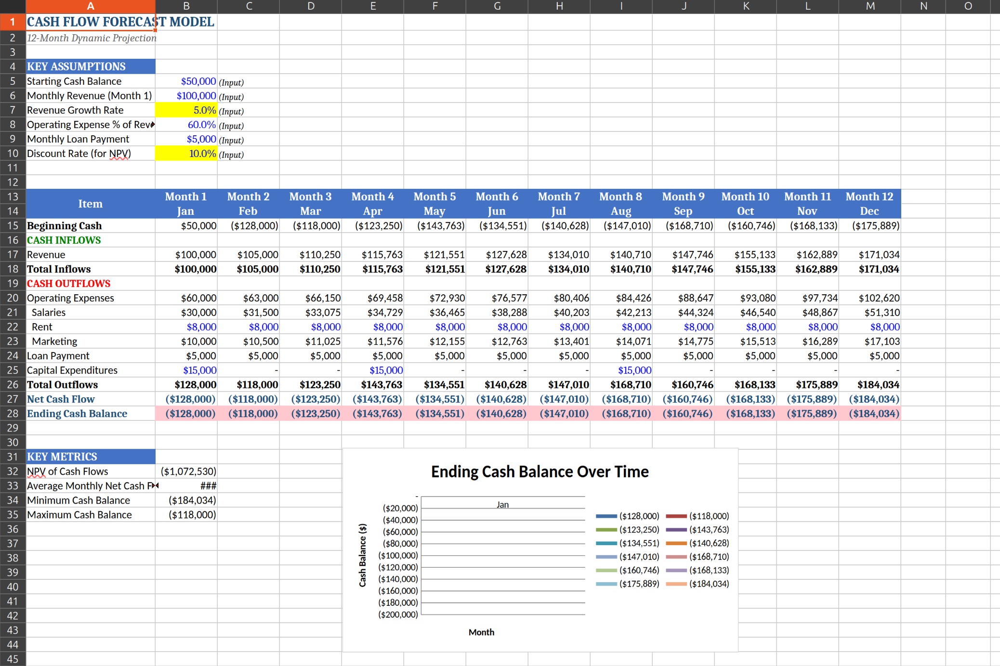

# Advanced Financial Modeling Suite

## Overview

This project demonstrates three professional-grade financial models built in Excel:

1. 12-Month Dynamic Cash Flow Forecast
2. Credit Risk & Expected Loss Model
3. Portfolio Allocation & Sharpe Ratio Optimization Model

Built using industry-standard modeling practices and zero hardcoded values.

---

## Model 1: Cash Flow Forecast

- Monthly compounding revenue growth
- Operating expense modeling
- Capital expenditure timing
- Loan repayment structure
- NPV calculation
- Conditional liquidity alerts

📷 Screenshot:

---

## Model 2: Loan Risk Model

- 50-loan portfolio simulation
- PD × LGD × EAD expected loss framework
- Risk categorization by credit score
- Portfolio exposure summary

📷 Screenshot:

---

## Model 3: Portfolio Allocation

- 6 asset classes
- Weighted return & volatility modeling
- Sharpe ratio calculation
- 10-year projection
- Solver optimization ready

📷 Screenshot:

---

## Technical Skills Demonstrated

- Advanced Excel formulas (SUMPRODUCT, XLOOKUP, NPV)
- Scenario analysis
- Risk modeling concepts
- Portfolio theory fundamentals
- Financial forecasting
- Solver optimization
- Professional formatting standards

---

## Key Limitations (Intentional Simplifications)

- Portfolio risk assumes zero correlation
- Credit risk model captures expected loss only (not unexpected loss)
- No Monte Carlo simulation included

---

## File Access

Full model available in:
`models/advanced-financial-models.xlsx`

---

Built: February 2026
