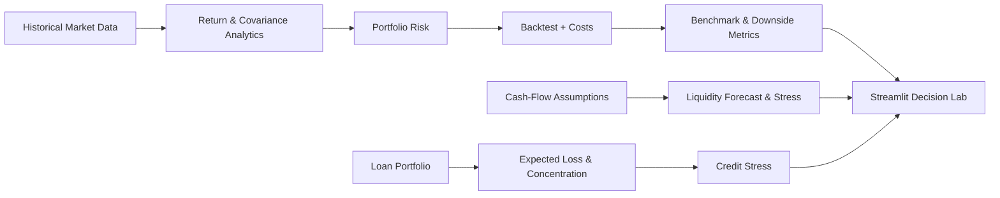
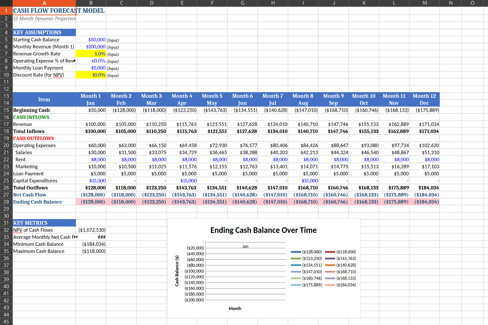
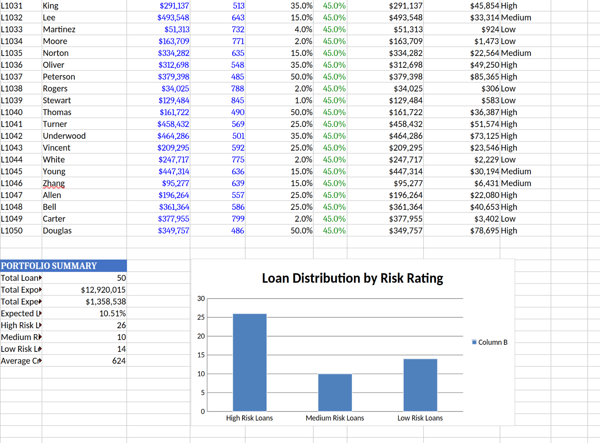
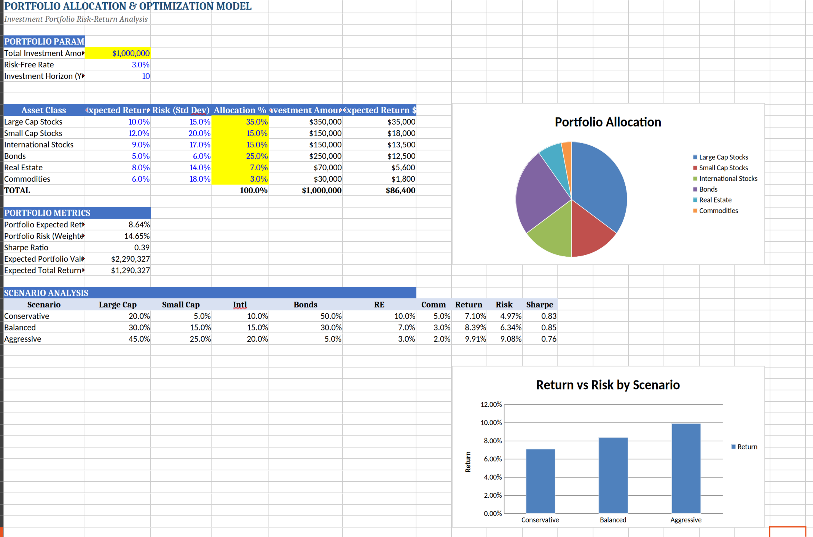

# Advanced Financial Modeling Suite

[](https://github.com/ParBproject/Advanced-Financial-Models/actions/workflows/ci.yml)
[](src/financial_models)
[](dashboard/app.py)
[](src/financial_models/market_data.py)
[](Advanced_Financial_Models.xlsx)

A quantitative-finance and decision-analytics project combining **real historical market data**, portfolio-risk estimation, credit-risk modeling, liquidity forecasting, stress testing, Monte Carlo simulation, an Excel workbook, and an interactive Streamlit dashboard.

The repository is designed to demonstrate both **Quantitative Specialist** and **Data Analyst** skills: data ingestion and cleaning, statistical estimation, risk-adjusted performance measurement, financial modeling, visualization, numerical validation, and reproducible software engineering.

## Employer snapshot

| Capability | Evidence in this repository |
|---|---|
| Real financial data | Historical adjusted market prices downloaded with yfinance |
| Data analysis | pandas/NumPy transformations, returns, correlations, covariance, drawdowns |
| Portfolio analytics | Expected return, volatility, Sharpe ratio, efficient-frontier simulation, rebalanced backtesting |
| Market risk | Historical VaR, Expected Shortfall, maximum drawdown, benchmark comparison |
| Performance analytics | CAGR, annualized volatility, Sharpe, Sortino, cumulative wealth |
| Credit risk | PD × LGD × EAD expected loss, concentration, stress attribution |
| Forecasting | 12-month cash-flow/liquidity forecast with scenario shocks |
| Simulation | Seeded Monte Carlo terminal-value distributions |
| Visualization | Streamlit dashboard and Excel workbook |
| Engineering | Modular Python package, regression tests, linting, CI on Python 3.10/3.12 |

## Real-market analytics workflow

### System architecture


```mermaid
flowchart LR
    A[Historical Market Data] --> B[Return & Covariance Analytics]
    B --> C[Portfolio Risk]
    C --> D[Backtest + Costs]
    D --> E[Benchmark & Downside Metrics]
    F[Cash-Flow Assumptions] --> G[Liquidity Forecast & Stress]
    H[Loan Portfolio] --> I[Expected Loss & Concentration]
    I --> J[Credit Stress]
    E --> K[Streamlit Decision Lab]
    G --> K
    J --> K
```


The market-risk layer makes the data provenance and calculation path explicit:

```text
Historical adjusted prices
        ↓
Cleaning and alignment
        ↓
Periodic asset returns
        ↓
Annualized return / volatility / covariance / correlation
        ↓
Target allocation + rebalance schedule + transaction costs
        ↓
Net portfolio return series
        ↓
CAGR / Sharpe / Sortino / drawdown
        ↓
Historical VaR / Expected Shortfall
        ↓
Portfolio vs benchmark comparison
```

The implementation lives in `src/financial_models/market_data.py` and is exposed through the **Market Risk** tab in the dashboard.

### Real-data example

```bash
python -m pip install -e ".[market-data]"
python examples/real_market_risk.py
```

The example downloads historical data for **SPY, QQQ, TLT, and GLD**, estimates the covariance structure from observed returns, constructs a weighted portfolio return series, and calculates downside-risk statistics.

## Interactive decision dashboard

Install and run:

```bash
python -m pip install -e ".[dashboard]"
streamlit run dashboard/app.py
```

The dashboard contains six analytical views:

- **Overview** — executive financial KPIs
- **Cash Flow** — editable 12-month liquidity forecast
- **Credit Risk** — borrower-level expected-loss analysis
- **Market Risk** — real historical data, configurable rebalancing/transaction costs, CAGR, volatility, Sharpe, Sortino, VaR, Expected Shortfall, drawdown, correlation, and benchmark comparison
- **Portfolio** — covariance-aware simulation and approximate efficient frontier
- **Stress & Monte Carlo** — liquidity/credit shocks and terminal-wealth simulation

## 1. Market Risk & Performance Analytics

The historical-data module converts observed prices into a reproducible market-risk dataset.

It calculates:

- simple periodic returns;
- annualized mean returns;
- annualized covariance and volatility;
- correlation matrices;
- maximum drawdown;
- cumulative portfolio wealth;
- CAGR;
- Sharpe ratio;
- Sortino ratio;
- historical Value at Risk (VaR);
- historical Expected Shortfall (ES);
- periodic portfolio rebalancing;
- one-way turnover;
- configurable proportional transaction costs.

Portfolio weights are validated and must represent a fully invested long-only portfolio. The historical backtest lets the user choose a rebalance interval and transaction-cost assumption, tracks turnover explicitly, and compares net portfolio performance with a selected benchmark over the same aligned observation window.

This section uses externally downloaded historical market data. Results depend on the selected symbols, date range, and data availability.

## 2. Cash-Flow Forecast



The 12-month model compounds revenue growth, forecasts operating expenses, rent, debt service and CapEx, and tracks liquidity month by month.

**Core outputs:** ending cash, average monthly net cash flow, minimum/maximum liquidity, and NPV.

`CashFlowStressScenario` can independently shock starting revenue, monthly growth, operating-expense ratio, fixed costs, and CapEx. Baseline and stressed results are kept separate for transparent scenario comparison.

## 3. Credit Risk Analytics



The credit model maps score bands to probability of default, applies an LGD assumption, and calculates:

> **Expected Loss = EAD × PD × LGD**

The analytics layer includes:

- portfolio exposure and expected-loss aggregation;
- average borrower score and risk-rating counts;
- borrower concentration;
- top-N exposure share;
- Herfindahl-Hirschman Index (HHI);
- effective borrower count;
- segment-level stress attribution;
- PD/LGD stress scenarios with economic bounds.

The bundled credit assumptions are illustrative and are not presented as a production underwriting model.

## 4. Portfolio Allocation & Optimization Research



The workbook and Python package evaluate six asset classes using expected return, volatility, allocation weights, Sharpe ratio, and long-horizon projected value.

The advanced portfolio layer uses:

> **Portfolio variance = wᵀΣw**

and provides:

- covariance/correlation validation;
- covariance-aware portfolio metrics;
- reproducible long-only portfolio simulation;
- sampled maximum-Sharpe portfolios;
- sampled minimum-volatility portfolios;
- approximate efficient-frontier extraction.

The original workbook-comparable baseline remains available for reconciliation, while the real-market module can estimate covariance directly from historical observations.

## 5. Monte Carlo & Stress Testing

The Monte Carlo layer converts portfolio expected return and covariance-aware volatility into reproducible terminal-value distributions.

Outputs include:

- mean and median terminal wealth;
- 5th and 95th percentiles;
- probability of loss;
- complete terminal-value samples.

Stress modules separately test liquidity and credit assumptions so scenario effects are explicit rather than hidden inside the baseline models.

## Repository architecture

```text
Advanced-Financial-Models/
├── Advanced_Financial_Models.xlsx
├── Financial_Models_User_Guide.txt
├── dashboard/
│   └── app.py
├── src/financial_models/
│   ├── market_data.py
│   ├── cash_flow.py
│   ├── credit_risk.py
│   ├── credit_concentration.py
│   ├── portfolio.py
│   ├── advanced_portfolio.py
│   └── stress_testing.py
├── examples/
│   ├── real_market_risk.py
│   ├── basic_analysis.py
│   ├── efficient_frontier.py
│   ├── stress_analysis.py
│   └── credit_concentration.py
├── tests/
├── .github/workflows/ci.yml
└── CONTRIBUTING.md
```

## Reproduce the project

```bash
git clone https://github.com/ParBproject/Advanced-Financial-Models.git
cd Advanced-Financial-Models

python -m venv .venv
source .venv/bin/activate

python -m pip install -e ".[dev,dashboard]"
python -m unittest discover -s tests -v
ruff check src tests examples dashboard
streamlit run dashboard/app.py
```

## Numerical validation

The automated suite includes regression checks for:

- cash-flow arithmetic and discounting;
- credit expected-loss calculations;
- concentration metrics and stress reconciliation;
- symmetric positive-semidefinite covariance validation;
- hand-calculated portfolio variance using **wᵀΣw**;
- seeded simulation reproducibility;
- portfolio allocation constraints;
- historical return calculations;
- portfolio return aggregation;
- VaR / Expected Shortfall ordering;
- CAGR and cumulative wealth compounding;
- drawdown and risk-adjusted performance behavior;
- daily rebalancing consistency when transaction costs are zero;
- turnover and transaction-cost effects on terminal wealth;
- Monte Carlo percentile ordering and bounded loss probabilities.

CI runs the full quality pipeline on Python **3.10 and 3.12**.

## Skills demonstrated

**Quantitative finance:** covariance modeling, portfolio risk, historical backtesting, turnover and transaction-cost analysis, VaR, Expected Shortfall, Monte Carlo, stress testing, Sharpe/Sortino analysis, expected loss.

**Data analysis:** pandas, NumPy, data validation, time-series transformation, descriptive statistics, KPI design, benchmark comparison, visualization.

**Software engineering:** modular Python, dataclasses, unit testing, CI/CD, reproducible random seeds, input validation, package design.

**Business communication:** Excel modeling, executive KPIs, interactive dashboarding, explicit assumptions and limitations.

## Related portfolio projects

This repository is the broad financial-modeling flagship. The following projects provide deeper evidence in specific quantitative and analytics areas:

| Project | Focus |
|---|---|
| [Portfolio Optimizer](https://github.com/ParBproject/Portfolio-Optimizer) | Walk-forward portfolio optimization, covariance shrinkage, transaction costs, turnover, efficient frontiers |
| [Stock Price Predictor](https://github.com/ParBproject/stock-price-predictor) | LSTM / Random Forest forecasting, naïve baselines, leakage controls, return-space evaluation |
| [AI Investment Dashboard](https://github.com/ParBproject/AI-Investment-Dashboard) | Black–Scholes, Greeks, implied volatility, binomial trees, Monte Carlo option pricing |
| [Commodity Price Forecaster](https://github.com/ParBproject/commodity-price-forecaster) | ARIMA / Prophet forecasting, rolling-origin baselines, MASE, weather context |
| [Credit Risk Analytics](https://github.com/ParBproject/Portfolio-Risk-Analysis-Credit-Risk-Modeling) | PD validation, calibration, expected loss, concentration, stress testing |
| [Fulfillment Operations Analytics](https://github.com/ParBproject/E-commerce-Order-Fulfillment-Process-Improvement) | SQL, DuckDB, KPI governance, Pareto analysis, data quality, executive dashboarding |

Together, these repositories demonstrate a consistent workflow across domains: **data → validation → quantitative/statistical modeling → out-of-sample or stress evaluation → decision-oriented reporting → automated tests**.

## Data and model limitations

- Historical market data is obtained from an external provider through `yfinance`; availability and revisions are provider-dependent.
- Historical return and covariance estimates are sample estimates and can change materially with the selected period.
- The historical portfolio backtest includes configurable proportional transaction costs, but not taxes, bid-ask spread, market impact, or every implementation cost.
- Credit PD mappings and stress multipliers are illustrative portfolio assumptions.
- Credit expected loss is not regulatory capital or unexpected loss.
- Cash-flow stress scenarios are deterministic and do not assign macroeconomic probabilities.
- Monte Carlo results depend on their distributional assumptions.
- Historical and simulated performance does not guarantee future performance.

## Roadmap

- Rolling out-of-sample portfolio optimization
- Shrinkage / robust covariance estimators
- Exportable scenario and benchmark reports
- Additional credit concentration dimensions
- Hosted dashboard deployment

## Disclaimer

This repository is an educational portfolio project and is not investment, lending, accounting, or financial advice.

## License

MIT — see [LICENSE](LICENSE).
