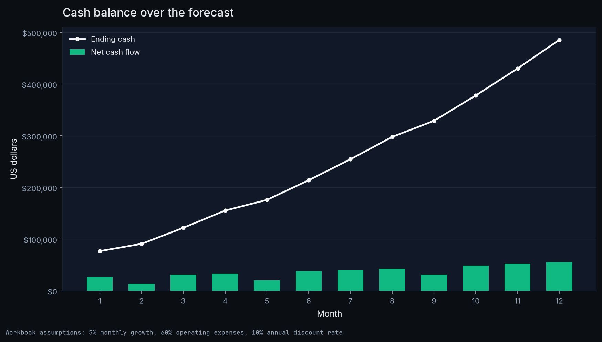
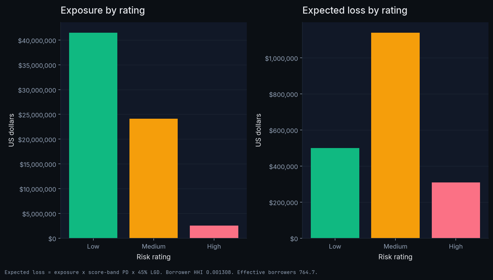
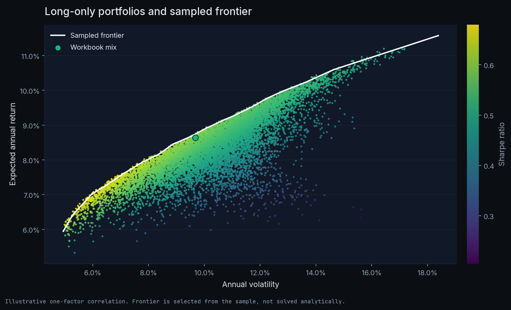
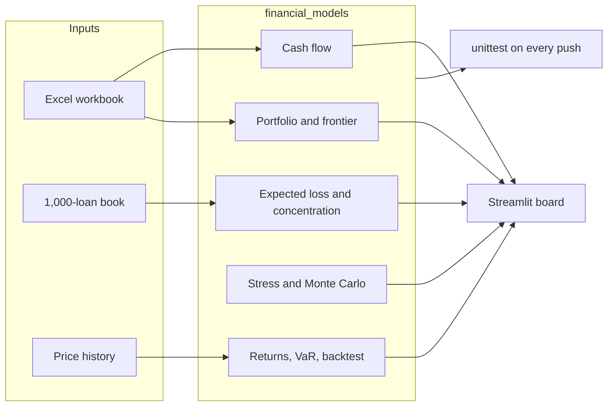

# Advanced Financial Models

[](https://parbproject.github.io/Advanced-Financial-Models/)

Cash-flow forecasts, credit expected loss, and portfolio risk, with the same calculations in an Excel workbook, a tested Python package, and a Streamlit board.

**[Open the live demo](https://parbproject.github.io/Advanced-Financial-Models/).** It is this Streamlit board, running in the browser from GitHub Pages. There is no sign-in and no server to keep running. Price downloads need a local `yfinance` install; the hosted Market risk tab uses the worked example and CSV upload.

The baseline book is a 12-month liquidity forecast, a score-band expected-loss model, and a six-asset allocation. The Python package adds borrower concentration, covariance-aware risk, stress tests, a seeded Monte Carlo, and historical VaR, expected shortfall, and rebalanced backtests.

[](https://github.com/ParBproject/Advanced-Financial-Models/actions/workflows/ci.yml)
[](https://www.python.org/)
[](LICENSE)

<p align="center">
  
</p>
<p align="center">
  
</p>
<p align="center">
  
</p>

On the workbook assumptions the forecast ends at **$485,685** cash, with an NPV of monthly net cash flows of **$410,751**. The 1,000-loan book has **$68,121,079.07** of exposure and **$1,946,680.74** of expected loss at a 45% LGD. The covariance-aware balanced mix has **8.64%** expected return, **9.68%** volatility, and a Sharpe ratio of **0.58**. `python examples/render_charts.py` writes these charts.

## Architecture


```mermaid
flowchart LR
  subgraph inputs [Inputs]
    WB[Excel workbook]
    CSV[1,000-loan book]
    PX[Price history]
  end
  subgraph core [financial_models]
    CF[Cash flow]
    CR[Expected loss and concentration]
    PF[Portfolio and frontier]
    ST[Stress and Monte Carlo]
    MK[Returns, VaR, backtest]
  end
  WB --> CF
  WB --> PF
  CSV --> CR
  PX --> MK
  CF --> UI[Streamlit board]
  CR --> UI
  PF --> UI
  ST --> UI
  MK --> UI
  core --> Tests[unittest on every push]
```

## Quick start

```bash
git clone https://github.com/ParBproject/Advanced-Financial-Models.git
cd Advanced-Financial-Models
python -m pip install -e ".[dashboard]"

python examples/basic_analysis.py
python examples/efficient_frontier.py
python examples/stress_analysis.py
python examples/credit_concentration.py
python examples/credit_book.py
python examples/render_charts.py
streamlit run dashboard/app.py
```

`basic_analysis.py` prints the workbook baseline: ending cash **$485,685**, three-loan expected loss **$20,812**, zero-correlation volatility **6.82%**, Sharpe ratio **0.83**. Charts land in `docs/images/`.

Live price downloads are optional and are not required for the commands above:

```bash
python -m pip install -e ".[market-data]"
```

The Market risk tab can then download adjusted closes. It also runs a short constructed price path that is labeled as a worked example, not as market history. Samples shorter than 60 returns are not annualized, and the 3% risk-free rate is scaled by how much of a year those observations cover. 95% VaR, expected shortfall, and Sortino are shown only with at least 20 returns. Sortino also needs at least three returns below the risk-free rate. The reported Sharpe, drawdown, and VaR are the rebalanced backtest after costs. Buy-and-hold and a costless constant mix are shown beside it. The default schedule is every 21 periods, commission is 5 bps, and slippage starts at 0 bps until you set it. A download of today's tickers does not put delisted names back into the sample.

## Modules

| Module | What it calculates |
|---|---|
| `cash_flow` | Monthly revenue, operating expenses, rent, debt service, and CapEx. NPV uses the effective monthly rate from the annual discount assumption. |
| `credit_risk` | Score-band PD, LGD, and expected loss = exposure × PD × LGD. Ratings follow the workbook: High at PD ≥ 20%, Medium at PD ≥ 7%. |
| `credit_concentration` | Borrower HHI, effective borrower count, top-N share, and segment stress attribution. |
| `loan_book` | Loads the 1,000-loan CSV. Expected loss uses the score-band probability of default, not the probability stored on each row. `credit_book_benchmark` compares those bands with the file's default flag. |
| `portfolio` | Excel-comparable zero-correlation volatility, √Σ(weight × volatility)². |
| `advanced_portfolio` | Correlation checks, covariance risk wᵀΣw, long-only simulation, and a sampled frontier. |
| `stress_testing` | Cash-flow and credit shocks, with PD and LGD capped at 100%. Terminal wealth is a lognormal Monte Carlo matched to the covariance-aware mean and variance. |
| `market_data` | Simple returns, drawdown, Sharpe, Sortino, historical VaR and expected shortfall, and a fixed-weight backtest. A period is earned on the weights from the previous close. Commission and slippage are separate one-way costs, and the opening trade is not charged. Buy-and-hold is the no-trade benchmark. Rows with a missing price are dropped. Unsorted or duplicate timestamps are rejected. |
| `theme`, `charts` | One dark theme for the matplotlib figures and the Plotly board. |
| `dashboard/app.py` | Streamlit board for cash flow, credit, portfolio risk, stress, and market history. |

The bundled six-asset correlation matrix is a one-factor illustration. It is not a historical estimate. On that matrix the balanced portfolio's volatility is **9.68%**, above the **6.82%** zero-correlation figure, because the equity sleeves move together.

## Worked results

These numbers come from the example scripts in this repo.

**Liquidity, workbook assumptions.** Month 1 net cash flow is **$27,000**: $100,000 revenue, less 60% operating expenses, $8,000 rent, and $5,000 debt service. CapEx of $15,000 falls in months 2, 5, and 9. The 12-month minimum cash balance is **$77,000**.

**Credit.** A $100,000 loan at a score of 620 is a 15% PD. At 45% LGD, expected loss is **$6,750**. On the 1,000-loan book, borrower HHI is **0.001308**, about **764.7** effective borrowers. The largest borrower is `CUST_0209` at **0.26%** of exposure. At PD × 1.75 and LGD × 1.25, stressed expected loss is **$4,258,364.12**.

The **$1,946,680.74** figure is the workbook score-band model, not this file's realized loss. **298 of 1,000** loans are flagged default (**29.80%** by count, **17.23%** of exposure). At the same 45% LGD that flag implies **$5,280,499.26** of loss. The bands rank risk — realized default rates rise as scores fall — but from 700 down they sit below the realized rates. The stored `PD_Score` matches that default flag in aggregate (exposure-weighted PD **17.23%**), so it is not a second forecast. The file has no origination date, so this comparison is in-sample, not a walk-forward test.

The file's 5th and 1st percentiles of per-customer net income are **$43,146.55** and **$25,890.70**. Those are income levels, not a portfolio loss VaR. Loans with an operational-risk score above 60 default at **29.67%** (27 of 91), against **29.81%** (271 of 909) at or below 60.

**Portfolio.** $1,000,000 compounded at the 8.64% expected return for 10 years is **$2,290,327**. A 10,000-path Monte Carlo of the covariance-aware mix, seed 42, has a median terminal value of **$2,183,803**, a 5th percentile of **$1,379,556**, a 95th percentile of **$3,504,411**, and a **0.22%** probability of finishing below the initial investment.

**Severe cash-flow stress** (revenue × 0.80, monthly growth −3 percentage points, operating-expense ratio +10 percentage points, fixed costs × 1.10, CapEx × 1.20) changes ending cash by **−$339,395** and NPV by **−$320,315**.

## Testing

```bash
python -m pip install -e ".[dev,dashboard]"
ruff check src tests examples dashboard demo
python -m pytest tests -q
```

The suite pins the guide identity **$100,000 × 15% PD × 45% LGD = $6,750** expected loss, the month-1 cash identity, the effective monthly discount, borrower HHI on a hand-calculated book, the 1,000-loan score-band loss against the **$5,280,499.26** realized-loss proxy, covariance math, PD and LGD caps, the seeded 10,000-path Monte Carlo percentiles, the severe cash-flow stress, historical VaR and expected shortfall, Sortino against the risk-free threshold, the previous-close execution rule, and the workbook formulas for cash flow and zero-correlation volatility. Covariance-aware volatility on the illustrative matrix stays **9.68%**.

GitHub Actions runs that suite on every push and every pull request, on Python 3.10 and 3.12. The Pages workflow also builds the browser bundle, and `tests/test_demo_build.py` checks that the bundle still reports the workbook ending cash, the 1,000-loan expected loss, and the covariance-aware volatility.

## Workbook

- [Advanced_Financial_Models.xlsx](Advanced_Financial_Models.xlsx)
- [Financial_Models_User_Guide.txt](Financial_Models_User_Guide.txt)

The cash-flow sheet discounts every month at `(1 + 10%)^(1/12) − 1`. Net cash flow is total inflows minus operating expenses, rent, debt service, and CapEx. Salary and marketing lines are memos and are not added on top of the 60% operating-expense ratio. Portfolio risk is the same zero-correlation volatility as `portfolio_metrics`.

## Assumptions

Expected loss is not regulatory capital or unexpected loss. Score-band default rates and stress multipliers are portfolio assumptions, not a credit decision, and on the 1,000-loan file they are not the realized default rate. HHI does not estimate default correlation. The Monte Carlo uses independent yearly lognormal draws. Historical returns do not predict future returns. The backtest does not charge an opening trade, and slippage is zero until it is set. This repository is an educational project and is not investment, lending, accounting, or financial advice.

## License

MIT. See [LICENSE](LICENSE).
